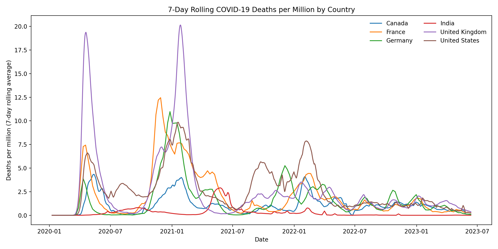
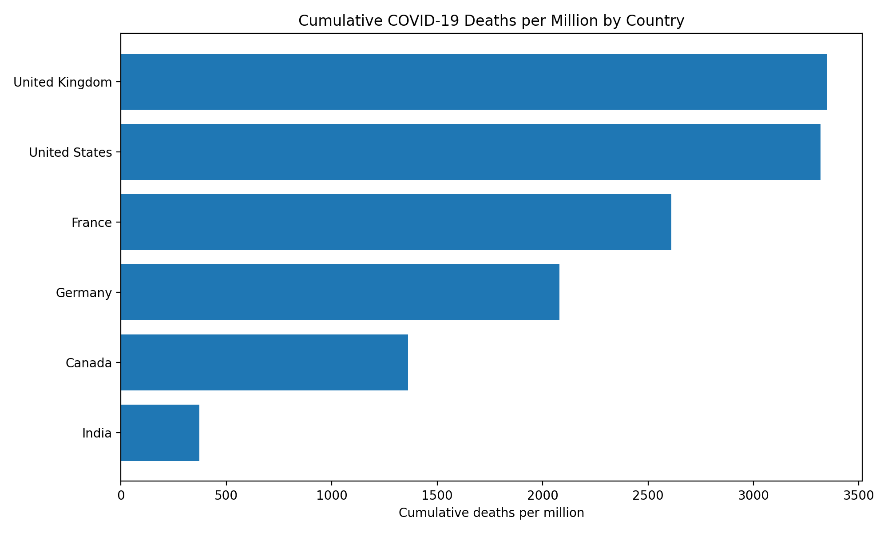
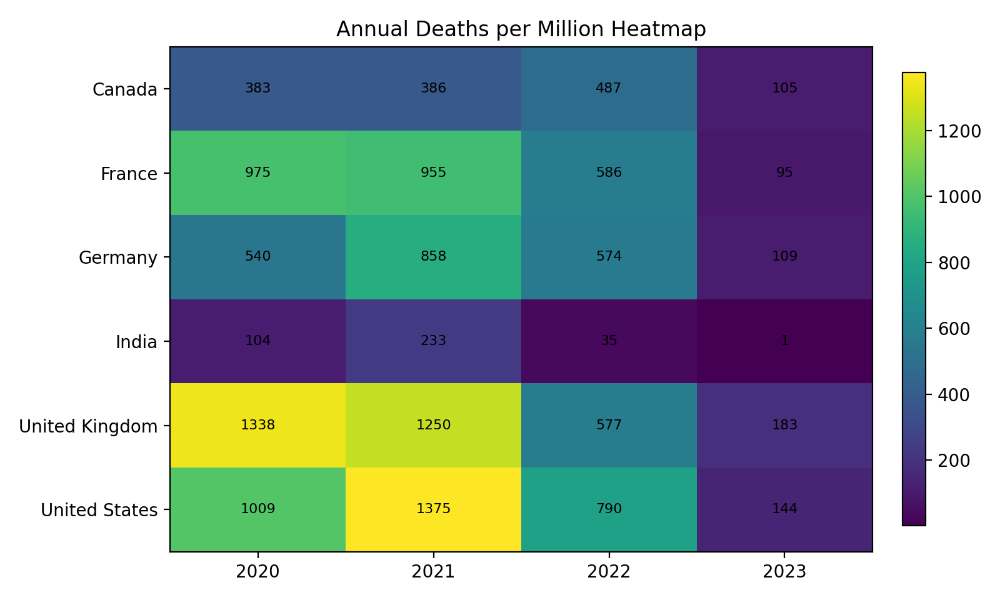

# 📊 Global COVID-19 Mortality Analysis

**Portfolio-ready end-to-end data analysis project** focused on global COVID-19 mortality trends using time-series analysis, feature engineering, KPI design, clustering, and dashboard storytelling.

> **GitHub repo description:** End-to-end data analysis project exploring global COVID-19 mortality trends using time-series analysis, feature engineering, and clustering techniques. Includes KPI development, rolling metrics, and interactive dashboard.

## 🔍 Overview
This project analyzes daily COVID-19 deaths per million across six countries — Canada, France, Germany, India, the United Kingdom, and the United States — to identify mortality patterns, compare severity, detect waves, and evaluate recovery after major peaks.

The project is intentionally structured like a professional analytics case study so it can be used in a **GitHub portfolio, CV, LinkedIn profile, and job applications**.

## 🎯 Business-style objectives
- Analyze mortality trends over time using smoothed time-series methods
- Detect pandemic waves using rolling averages and peak logic
- Compare countries using normalized KPIs rather than raw totals
- Segment countries by mortality profile using clustering
- Communicate results through stakeholder-ready visuals and an interactive dashboard

## 🛠️ Tools and skills demonstrated
- **Python:** pandas, NumPy, SciPy, scikit-learn, Plotly, Matplotlib
- **Analytics:** data cleaning, feature engineering, KPI design, segmentation, time-series analysis
- **Communication:** executive summary, data storytelling, dashboard development, recruiter-friendly documentation
- **SQL:** example analytical queries for interview and portfolio use

## 📂 Project structure
```text
covid19-global-mortality-analysis/
├── data/
│   ├── raw/
│   └── processed/
├── dashboard/
├── linkedin/
├── notebooks/
├── reports/
├── resume/
├── sql_analysis/
├── src/
├── visuals/
├── README.md
└── requirements.txt
```

## 📈 Key insights
- **Highest cumulative burden:** United Kingdom (3347.9 deaths per million) and United States (3318.7)
- **Highest single-wave peak:** United Kingdom reached a 7-day rolling peak of 20.14 deaths per million
- **Slowest recovery after the main peak:** France took 171 days to fall below 25% of peak mortality
- **Strongest monthly shock:** United Kingdom in 2021-01 with 507.5 deaths per million
- **Segmentation result:** countries separate into distinct burden/recovery profiles rather than one uniform pandemic pattern

## 📊 Visual preview
### Rolling mortality trends


### Cumulative mortality burden


### Annual mortality heatmap


## 🧪 Methodology
1. Cleaned and standardized the raw daily dataset
2. Engineered rolling averages, daily changes, cumulative burden, and time buckets
3. Built country-level KPIs including peak severity, wave count, recovery speed, and volatility
4. Applied clustering to group countries with similar mortality patterns
5. Produced static visuals, processed tables, and an interactive dashboard
6. Added SQL examples and recruiter-facing assets for job applications

## 🚀 How to run
```bash
pip install -r requirements.txt
python src/data_prep.py
python src/analysis.py
jupyter notebook notebooks/covid_mortality_analysis.ipynb
```

Open the dashboard in a browser:
```text
dashboard/covid_dashboard.html
```

## 💼 Why this project works for a data analyst job search
This project demonstrates that you can:
- structure an analysis repo professionally
- turn a raw CSV into decision-useful KPIs
- use time-series methods instead of only basic descriptive charts
- write clearly for technical and non-technical audiences
- present analysis in a format that recruiters can review quickly

## 📌 Recommended files to highlight on GitHub
- `README.md`
- `visuals/rolling_trends.png`
- `dashboard/covid_dashboard.html`
- `reports/case_study.md`
- `sql_analysis/queries.sql`

## 🔗 LinkedIn-ready project summary
> Built an end-to-end data analysis project in Python exploring COVID-19 mortality trends across six countries. Cleaned and transformed daily time-series data, engineered rolling KPIs, detected mortality waves, measured recovery speed, segmented countries using clustering, and delivered both static visuals and an interactive dashboard for stakeholder-ready insights.
